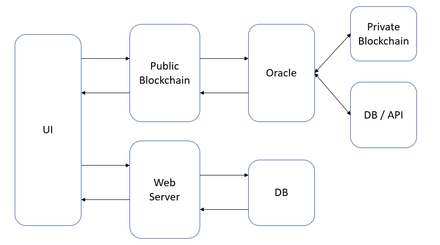

# Link3.0

## Objective

Improve the "Trust" aspects of the information on professional sites like Linked-In

## Documentary

Given that the information in these professional sites is going to be quite diverse, this would be an attempt to see what can be done to improve trust aspects one at a time as part of ChainLink hackathon using ChainLink Oracles. Once we have basic pieces working, goal would be to expand on this further to make it more comprehensive.

## Initial Architecture

Approach for the architectural pieces would be to gradually move from Web2.0 to Web3.0.

## Tech Stack

* Front-End: Java Script, React, TBD
* Public Blockchain: Ethereum, HardHat, Chai, IPFS
* Oracle: ChainLink
* Private Blockchain: Hyperledger Indy
* Database: Amazon S3
* Web Server: AWS/TBD
* APIs: TBD
* ZK: TBD
